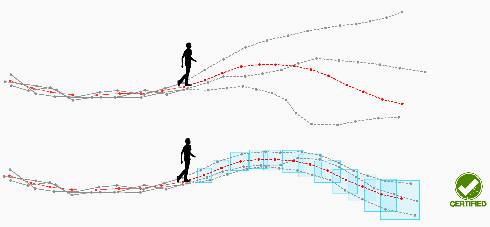

# S-attack: <br/> A library for evaluating trajectory prediction models and making them robust
This repo contains three research projects to assess the trajectory prediction models, [__Scene-attack__](https://github.com/vita-epfl/s-attack#scene-attack) which evaluates the scene-understanding of models, [__Social-attack__](https://github.com/vita-epfl/s-attack#social-attack) which evaluates social understanding of them, and [__Certified__](https://github.com/vita-epfl/s-attack#certified) which introduces a certified performance.

---
> __Certified Human Trajectory Prediction, CVPR 2025__<br /> 
>  M. Bahari, S. Saadatnejad, A. Askari Farsangi, S. Moosavi-Dezfooli, A. Alahi <br /> 
>  __[Website](https://s-attack.github.io/)__  &nbsp; &nbsp; &nbsp; &nbsp; &nbsp; &nbsp; &nbsp; &nbsp; __[Paper](https://arxiv.org/abs/2403.13778)__ &nbsp; &nbsp; &nbsp; &nbsp; &nbsp; &nbsp; &nbsp; &nbsp; __[Citation](https://github.com/vita-epfl/s-attack#for-citation)__   &nbsp; &nbsp; &nbsp; &nbsp; &nbsp; &nbsp; &nbsp; &nbsp;  __[Code](https://github.com/vita-epfl/s-attack/tree/master/certified)__
     


---

> __Vehicle trajectory prediction works, but not everywhere, CVPR 2022__<br /> 
>  M. Bahari, S. Saadatnejad, A. Rahimi, M. Shaverdikondori, A. Shahidzadeh, S. Moosavi-Dezfooli, A. Alahi <br /> 
>  __[Website](https://s-attack.github.io/)__  &nbsp; &nbsp; &nbsp; &nbsp; &nbsp; &nbsp; &nbsp; &nbsp; __[Paper](https://arxiv.org/abs/2112.03909)__ &nbsp; &nbsp; &nbsp; &nbsp; &nbsp; &nbsp; &nbsp; &nbsp; __[Citation](https://github.com/vita-epfl/s-attack#for-citation)__   &nbsp; &nbsp; &nbsp; &nbsp; &nbsp; &nbsp; &nbsp; &nbsp;  __[Code](https://github.com/vita-epfl/s-attack/tree/master/scene-attack)__
     


---

> __Are socially-aware trajectory prediction models really socially-aware?, TR_C 2022__<br /> 
> S. Saadatnejad, M. Bahari, P. Khorsandi, M. Saneian, S. Moosavi-Dezfooli, A. Alahi <br /> 
> __[Website](https://s-attack.github.io/)__  &nbsp; &nbsp; &nbsp; &nbsp; &nbsp; &nbsp; &nbsp; &nbsp; __[Paper](https://arxiv.org/abs/2108.10879)__ &nbsp; &nbsp; &nbsp; &nbsp; &nbsp; &nbsp; &nbsp; &nbsp; __[Citation](https://github.com/vita-epfl/s-attack#for-citation)__  &nbsp; &nbsp; &nbsp; &nbsp; &nbsp; &nbsp; &nbsp; &nbsp;  __[Code](https://github.com/vita-epfl/s-attack/tree/master/social-attack)__
     


---


### For citation:
```
@InProceedings{bahari2025certified,
    author    = {Bahari, Mohammadhossein and Saadatnejad, Saeed and Askari Farsangi, Amirhossein and Moosavi-Dezfooli, Seyed-Mohsen and Alahi, Alexandre},
    title     = {Certified Human Trajectory Prediction},
    booktitle = {Proceedings of the IEEE/CVF Conference on Computer Vision and Pattern Recognition (CVPR)},
    year      = {2025},
}

@InProceedings{bahari2022sattack,
    author    = {Bahari, Mohammadhossein and Saadatnejad, Saeed and Rahimi, Ahmad and Shaverdikondori, Mohammad and Shahidzadeh, Amir-Hossein and Moosavi-Dezfooli, Seyed-Mohsen and Alahi, Alexandre},
    title     = {Vehicle trajectory prediction works, but not everywhere},
    booktitle = {Proceedings of the IEEE/CVF Conference on Computer Vision and Pattern Recognition (CVPR)},
    year      = {2022},
}

@article{saadatnejad2022sattack,
     author = {Saeed Saadatnejad and Mohammadhossein Bahari and Pedram Khorsandi and Mohammad Saneian and Seyed-Mohsen Moosavi-Dezfooli and Alexandre Alahi},
     title = {Are socially-aware trajectory prediction models really socially-aware?},
     journal = {Transportation Research Part C: Emerging Technologies},
     volume = {141},
     pages = {103705},
     year = {2022},
     issn = {0968-090X},
     doi = {https://doi.org/10.1016/j.trc.2022.103705},
}

``` 
