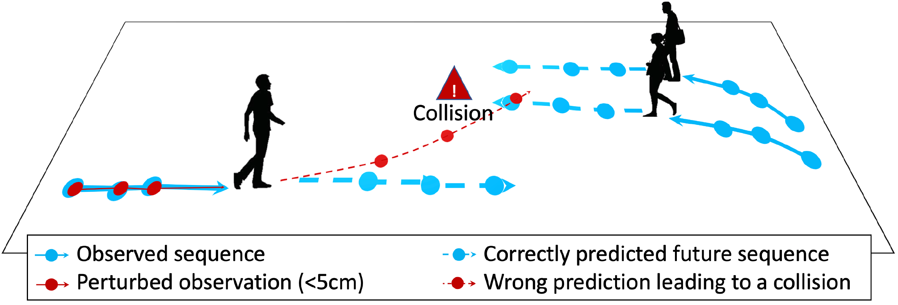
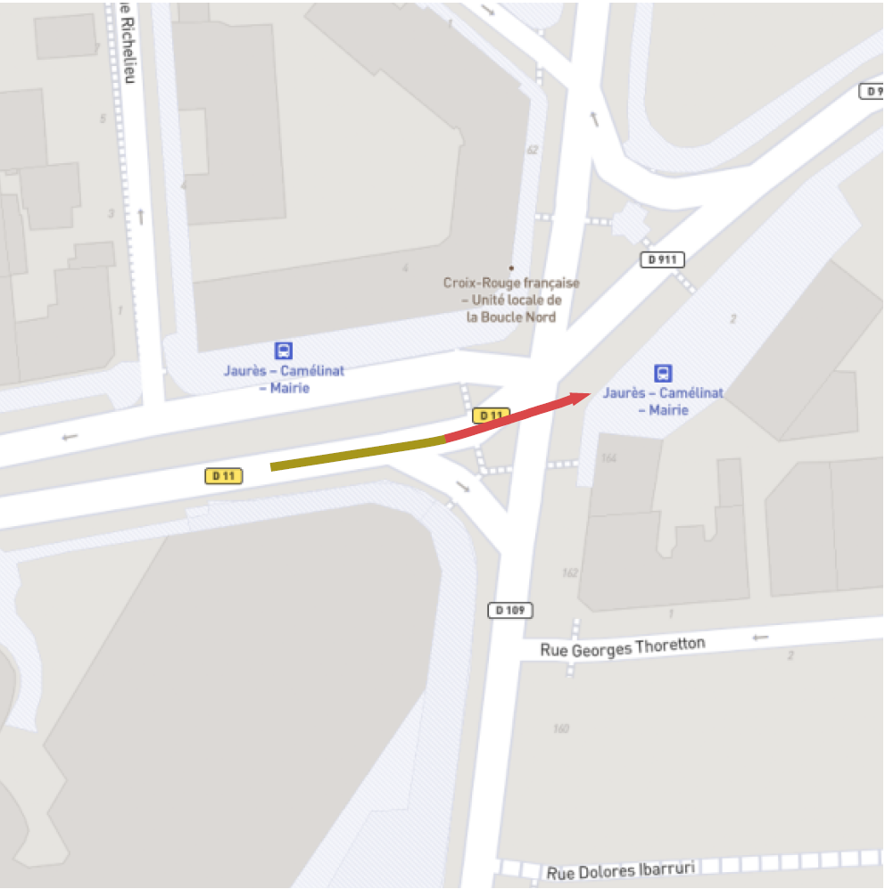

# S-attack library: <br/> A library for evaluating trajectory prediction models
This library contains two research projects which assess the trajectory prediction models, [__Social-attack__](https://github.com/vita-epfl/s-attack##Social-attack) which evaluates social understanding of models, and [__Scene-attack__](https://github.com/vita-epfl/s-attack##Scene-attack) which evaluates the scene-understanding of them.

---

> __Are socially-aware trajectory prediction models really socially-aware?__<br /> 
> S. Saadatnejad, M. Bahari, P. Khorsandi, M. Saneian, S. Dezfooli, A. Alahi,  arxiv 2021 <br /> 
> __[Website](https://s-attack.github.io/)__  &nbsp; &nbsp; &nbsp; &nbsp; &nbsp; &nbsp; &nbsp; &nbsp; __[Paper](https://arxiv.org/abs/2108.10879)__ &nbsp; &nbsp; &nbsp; &nbsp; &nbsp; &nbsp; &nbsp; &nbsp; __[Citation](https://github.com/vita-epfl/s-attack###for-citation)__  
     


---

> __Vehicle trajectory prediction works, but not everywhere__<br /> 
>  M. Bahari, S. Saadatnejad, A. Rahimi, M. Shaverdikondori, S. Dezfooli, A. Alahi,  arxiv 2021 <br /> 
>  __[Website](https://s-attack.github.io/)__  &nbsp; &nbsp; &nbsp; &nbsp; &nbsp; &nbsp; &nbsp; &nbsp; __[Paper]()__ &nbsp; &nbsp; &nbsp; &nbsp; &nbsp; &nbsp; &nbsp; &nbsp; __[Citation](https://github.com/vita-epfl/s-attack###for-citation)__ 
     


---

## Social-attack
### Are socially-aware trajectory prediction models really socially-aware?

The official code for the paper: "Are socially-aware trajectory prediction models really socially-aware?", [Webpage](https://s-attack.github.io/), [arXiv](https://arxiv.org/abs/2108.10879)

&nbsp;


#### Installation:

Start by cloning this repository:
```
git clone https://github.com/vita-epfl/s-attack
cd s-attack
```

And install the dependencies:
```
pip install .
```
For more info on the installation, please refer to [Trajnet++](https://thedebugger811.github.io/posts/2020/03/intro_trajnetpp/)

#### Dataset:
  
  * We used the trajnet++ [dataset](https://github.com/vita-epfl/trajnetplusplusdata/releases/tag/v4.0). For easy usage, we put data in DATA_BLOCK folder.
  
#### Training/Testing:
In order to attack the LSTM-based models (S-lstm, S-att, D-pool):
```
bash lrun.sh
```
In order to attack the GAN-based models:
```
bash grun.sh
```

## Scene-attack
### Vehicle trajectory prediction works, but not everywhere
To be released soon.


### For citation:
```
@article{saadatnejad2021sattack,
  title={Are socially-aware trajectory prediction models really socially-aware?},
  author={Saadatnejad, Saeed and Bahari, Mohammadhossein and Khorsandi, Pedram and Saneian, Mohammad and Moosavi-Dezfooli, Seyed-Mohsen and Alahi, Alexandre},
  year={2021}, eprint={2108.10879}, archivePrefix={arXiv}, primaryClass={cs.CV}
}
@article{Bahari2021sattack,
  title={Vehicle trajectory prediction works, but not everywhere},
  author={Bahari, Mohammadhossein and Saadatnejad, Saeed and Rahimi, Ahmad and Shaverdikondori, Mohammad and Moosavi-Dezfooli, Seyed-Mohsen and Alahi, Alexandre},
  year={2021}, eprint={}, archivePrefix={arXiv}, primaryClass={cs.CV}
}
``` 
